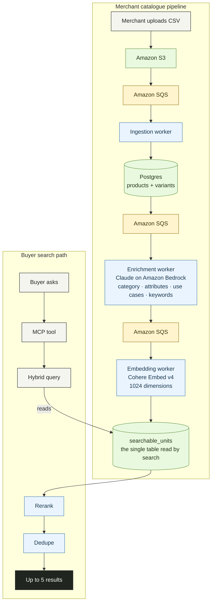
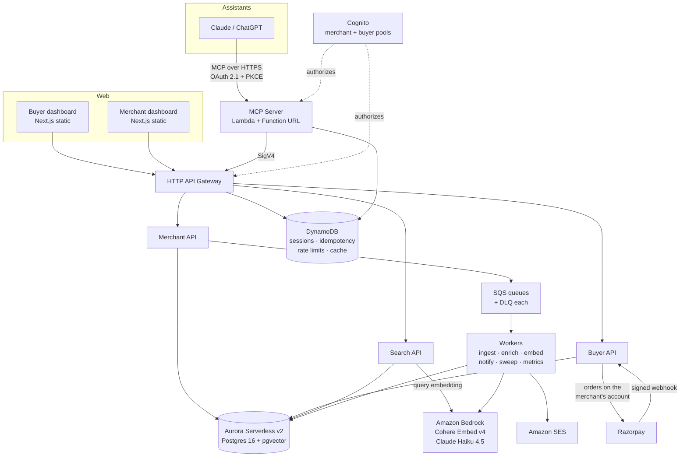
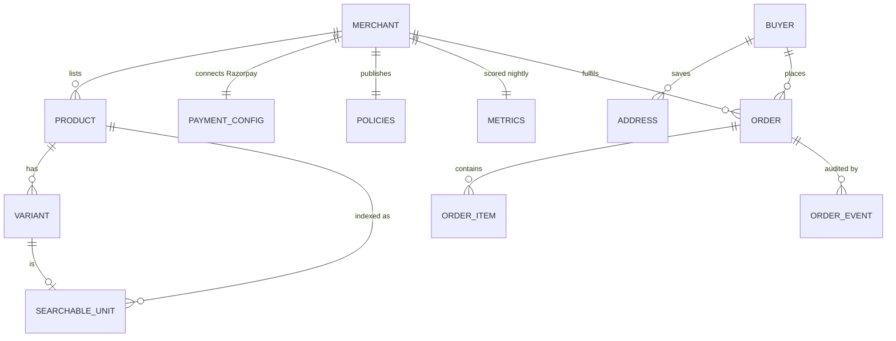

# Conciergent

**Indian merchants, discoverable and purchasable inside Claude and ChatGPT — with payment going straight to the merchant, and no commission.**

---

## Live Experiences

- **Landing page:** [https://conciergent.vercel.app/](https://conciergent.vercel.app/)
- **Buyer experience:** [https://main.d1ypcvqs4kcq44.amplifyapp.com/](https://main.d1ypcvqs4kcq44.amplifyapp.com/)
- **Merchant dashboard:** [https://main.d21osrv849o4of.amplifyapp.com/inventory](https://main.d21osrv849o4of.amplifyapp.com/inventory)

---

## Overview

Most commerce discovery now starts with a question rather than a search box. People ask an
assistant *"what should I get my colleague for a housewarming, under ₹3,000, arriving by
Saturday?"* — and the assistant has nothing real to answer with. It can describe products in
general, but it cannot see a live catalogue, cannot check whether something is in stock, and
certainly cannot buy it.

Meanwhile a small merchant in Bengaluru selling on WhatsApp and Instagram is invisible to
that conversation entirely. They have stock, prices and a delivery promise; they have no way
to put any of it where the question is being asked.

**Conciergent connects the two.** Merchants list their catalogue once. Buyers find and buy it
from inside the assistant they were already talking to, through an MCP server that exposes
search, comparison, policies and checkout as tools a model can call.

The commercial arrangement is the part worth pausing on: **payment goes directly into the
merchant's own Razorpay account.** Conciergent never holds funds and takes no commission. The
merchant is the merchant of record — their terms, their refund policy, their relationship
with the buyer. That constraint shapes the entire architecture, and most of the interesting
engineering decisions in this repository follow from it.

---

## Who Is This For?

### For Buyers

**Who:** anyone in India shopping through Claude or ChatGPT, or through the Conciergent web
surface directly.

**What it solves:** assistants give confident, unverifiable shopping advice. They invent
prices, guess at delivery times, and cannot complete a purchase. You end up doing the real
work yourself in a browser tab.

- **Ask in your own words.** "Something to record my drive" finds dashcams — no product name
  needed. Matching is semantic, not keyword.
- **Every fact is real and timestamped.** Prices and stock carry the moment they were last
  true. Nothing is inferred.
- **Constraints are honoured absolutely.** A budget or a delivery deadline *excludes* items
  rather than ranking them lower. Something that cannot arrive in time will not appear
  because it happens to be cheap.
- **Buy without leaving the conversation.** Connect your account once and the assistant can
  place an order against your saved address. It can never pay — only you can, on the
  merchant's own payment page.
- **You know who you are buying from.** Every result carries the merchant's real track record
  and their own refund policy, in their words.

### For Merchants

**Who:** Indian sellers of any size — a D2C brand, a single-city apparel label, a service
business. Especially those selling through WhatsApp and Instagram with no website.

**What it solves:** you cannot be found where buying decisions are now being made, and
marketplaces that could put you there take a commission and stand between you and your buyer.

- **Zero commission.** Money goes into your Razorpay account. We never touch it.
- **You remain the merchant of record.** Your terms, your policies, your customer.
- **List once, in whatever form you have.** Upload a CSV, or add products by hand. Your
  policies can be pasted as plain text — no website required.
- **See exactly why you rank.** "Preview in AI" runs the real buyer search and tells you
  whether you appeared, and if not, precisely which constraint excluded you.
- **Honest trust signals.** Verified GSTIN, orders fulfilled, on-time rate — and a new
  merchant is described as new rather than dressed up.

---

## Key Features

### Buyer Features
- Natural-language search across meaning, intent, keywords and images
- Hard filters on budget, delivery time, attributes and stock
- Side-by-side comparison with a normalised attribute matrix
- Merchant policies quoted verbatim, never generated
- Guest checkout, or one-tap ordering with a saved address
- Order history and status, in the assistant or on the web

### Merchant Features
- CSV bulk import with row-level validation and an error report
- Manual product entry, including an auto-generated variant matrix
- Inventory screen with bulk SKU-keyed stock updates
- Order lifecycle: acknowledge → pack → ship → deliver, with an audited event trail
- Razorpay connection verified against the live API before it is saved
- Pipeline visibility: exactly where each product is between upload and searchable

### Platform Features
- **MCP server** exposing nine tools to Claude and ChatGPT
- **AI enrichment** turning sparse listings into structured, searchable metadata
- **Hybrid retrieval** fusing four signals, reranked on business rules
- **Trust scoring** recomputed nightly from real fulfilment data
- **OAuth 2.1 + PKCE** so an assistant can act for a buyer, with granular consent
- Rate limiting, idempotent webhooks, and stock reservation that survives races

---

## How It Works

### The Buyer's Journey

1. **Connect** — copy the MCP URL from Conciergent into Claude or ChatGPT's connector
   settings. Searching and comparing work immediately, with no account. The sign-in prompt
   appears the first time your assistant reaches for something of yours.
2. **Approve** — you are sent to a Conciergent sign-in page and asked to grant three separate
   permissions: see your addresses, see your orders, place orders for you.
3. **Ask** — "a formal shirt for an office in Chennai, under ₹2,500". The assistant calls
   `search_products` with those constraints already parsed.
4. **Compare** — "compare the top three" returns an aligned attribute matrix naming only what
   actually differs.
5. **Check** — "what's their return policy?" is answered from the merchant's own text, with a
   source and a last-checked date.
6. **Order** — `place_order` reserves stock against your saved address and returns a payment
   link. **Nothing is charged yet.**
7. **Pay** — you open Razorpay Checkout and pay the merchant directly. If you do not, the
   reservation is released after twenty minutes.

### The Merchant's Journey

1. **Sign up** with email and verify it.
2. **Connect Razorpay** — paste your API keys. They are verified against Razorpay's live API
   *before* anything is stored; a rejected key leaves no trace.
3. **Write your policies** — refund, terms and fulfillment, as text in the dashboard or as
   links if you have them. AI extracts the return window, dispatch SLA and who pays return
   shipping.
4. **Go live** — a catalogue becomes visible only when *both* gates are clear: policies on
   file and payment verified. A merchant who cannot take payment is not shown to buyers.
5. **Add products** — CSV or the manual form. Behind the scenes: validated → AI-enriched →
   embedded → indexed. The dashboard shows each stage.
6. **Receive orders** — email within seconds of payment, with everything needed to pack it.
7. **Fulfil** — acknowledge, pack, ship with a tracking number. Every step is recorded.

### How Data Moves



Price and stock changes reach search in under a second through database triggers, and
**never** trigger re-embedding — re-embedding happens only when the text that describes a
product actually changes.

---

## System Architecture



**Component roles**

| Component | Responsibility |
| --- | --- |
| **MCP Server** | Nine tools for assistants. Validates OAuth tokens, forwards the buyer's own token so the API decides what they may see. |
| **Search API** | Hybrid retrieval and reranking. Latency-critical: 200 ms budget, no LLM call on this path. |
| **Merchant API** | Catalogue, inventory, orders, policies, payment configuration. |
| **Buyer API** | Profile, addresses, checkout, Razorpay webhooks. |
| **Workers** | Everything slow and asynchronous, each queue with its own dead-letter queue. |
| **Aurora + pgvector** | Products, orders, merchants — and the vectors, in the same database as the filters, so a constraint and a similarity search are one query. |
| **DynamoDB** | Anything ephemeral: sessions, idempotency keys, rate-limit buckets, query cache. |
| **Cognito** | Two separate pools. A buyer's token is signed by an issuer the merchant API does not accept. |

---

## Backend Design

### Services

- **`api-merchant`** — catalogue CRUD, CSV uploads, inventory, orders, policies, Razorpay
  configuration
- **`api-buyer`** — profile, addresses, checkout sessions, payment confirmation, webhooks
- **`api-internal`** — search and product detail; called by both dashboards and the MCP server
- **`mcp`** — the assistant-facing tool surface
- **Workers** — ingestion, enrichment, embedding, notification, policy checking, metrics,
  reservation sweeping, token refresh

### API Patterns

REST over an HTTP API Gateway. Every boundary validates with a Zod schema before anything
touches the database.

```
POST /search                       Public. Browsing needs no account.
POST /product                      Public product detail.
GET  /merchant/products            Merchant's own catalogue.
POST /merchant/products            Create, including a full variant matrix.
POST /merchant/payment-config      Verified against Razorpay before storing.
POST /merchant/policies            Text or URL; AI extracts the terms.
GET  /buyer/addresses              The buyer's own, always.
POST /checkout/session             Creates a session; reserves nothing.
POST /checkout/pay                 Reserves stock, creates the Razorpay order.
POST /checkout/confirm             Verifies the payment signature.
POST /webhooks/razorpay/{id}       HMAC-verified, idempotent.
GET  /health/deep                  Per-dependency status and latency.
```

### Authentication & Authorization

**Two Cognito user pools, not one pool with groups.** A single pool would put buyers and
merchants behind the same token issuer, so every merchant route would depend on a group check
to stay safe — and one missing check would expose the merchant surface to any buyer. Separate
pools make that failure impossible rather than unlikely.

**Identity always comes from the validated token, never from the request.** API Gateway
verifies the JWT before the handler runs; `requireMerchant(event)` reads the claim and has no
fallback to a header or body field.

| Caller | Authenticated by | May reach |
| --- | --- | --- |
| Merchant | Merchant pool JWT | Their own catalogue, inventory, orders |
| Buyer | Buyer pool JWT | Their own profile, addresses, orders |
| Assistant | OAuth 2.1 + PKCE, buyer pool | Whatever the buyer granted, per scope |
| MCP server → internal API | AWS SigV4 | Search and product detail |
| Razorpay webhook | HMAC over the body, merchant's secret | That merchant's orders only |
| Anyone | — | Public search, product detail, health |

Assistant permissions are **separately grantable**: `addresses.read`, `orders.read`,
`orders.write`. Someone letting software spend their money deserves finer control than one
undifferentiated yes.

### Data Model



Two decisions carry most of the weight:

**The variant is the searchable unit, not the product.** A buyer asking for "size 42 in
cotton" is asking about a specific row, and matching the product would return items whose
size-42 is out of stock. Results are deduplicated by product at the presentation edge so one
shirt cannot occupy every slot.

**`searchable_units` is denormalised on purpose.** It carries the merchant's status, trust
score, price, stock and vectors alongside the text, so a filtered similarity search is a
single query rather than a join across four tables under a 200 ms budget. Only the embedding
worker writes to it; database triggers keep the denormalised columns honest.

### Design Choices Worth Knowing

- **No LLM call in the search path.** The assistant already parsed the buyer's sentence into
  parameters. Re-parsing would add a second interpretation, a second chance to be wrong, and
  a second latency budget.
- **Constraints exclude, never penalise.** An item that cannot arrive in time is removed from
  the result set, not ranked lower.
- **Re-embed only when content changes.** Content is hashed; price and stock updates never
  trigger a model call.
- **Stock reservation is a conditional `UPDATE ... WHERE stock >= qty`.** Three buyers racing
  for one unit produce exactly one winner, decided by the database rather than by timing.
- **Webhooks are idempotent via a DynamoDB conditional write.** Five identical deliveries
  produce exactly one order transition.
- **Every queue has a dead-letter queue.** No exceptions.
- **Money is `bigint` paise everywhere.** Never a float; formatted for display only at the
  edge.

---

## Technology Stack

| Layer | Choice |
| --- | --- |
| **Language** | TypeScript, Node 22, ESM |
| **Monorepo** | pnpm workspaces + Turborepo (24 packages) |
| **Frontend** | Next.js 15 App Router, Tailwind, static export on AWS Amplify |
| **API** | AWS API Gateway HTTP API + Lambda (ARM64) |
| **Database** | Aurora Serverless v2 PostgreSQL 16, pgvector, RDS Proxy |
| **ORM** | Drizzle ORM with forward-only migrations |
| **Ephemeral store** | DynamoDB (sessions, idempotency, rate limits, cache) |
| **Queues** | SQS, every queue with a DLQ |
| **AI** | Amazon Bedrock — Cohere Embed v4 (1024-dim), Claude Haiku 4.5 |
| **Auth** | Amazon Cognito, two pools, OAuth 2.1 + PKCE for assistants |
| **Payments** | Razorpay, on each merchant's own account |
| **Email** | Amazon SES |
| **Infrastructure** | AWS CDK v2, seven stacks, `ap-south-1` |
| **Validation** | Zod at every boundary |
| **Testing** | Vitest (324 tests) + Playwright against deployed environments |
| **Observability** | AWS Lambda Powertools — structured logs with correlation IDs |

---

## Getting Started

**Prerequisites:** Node 20+, pnpm 11, PostgreSQL 18 with pgvector, and AWS credentials if you
intend to deploy.

> **On the two names.** The product is Conciergent. The workspace scope (`@catalograil/*`),
> the CloudFormation stacks and every deployed AWS resource are still named `catalograil`,
> which is what the project was called first. They are load-bearing — renaming a stack
> replaces the database behind it — so they stay until there is a reason worth that. If you
> see both names, nothing is broken.

```bash
git clone https://github.com/gauravk16in/conciergent.git
cd conciergent
pnpm install

# A local Postgres stands in for Aurora
brew install postgresql@18 pgvector
createdb catalograil
export DATABASE_URL="postgres://$(whoami)@localhost:5432/catalograil"

pnpm db:migrate          # creates extensions and applies migrations
pnpm db:seed             # demo catalogue — empty environments only

pnpm typecheck
pnpm test

# Dashboards
pnpm --filter @catalograil/merchant-app dev    # :3000
pnpm --filter @catalograil/buyer-app dev       # :3001
```

**Deploying:**

```bash
pnpm --filter @catalograil/infra exec cdk deploy --all --context env=dev
```

Two things that will bite otherwise:

- Deploys must carry `GITHUB_TOKEN_SECRET_NAME`, or the Frontend stack is silently dropped
  from the app and deploying the API alone then fails on an export still in use.
- Packages resolve through `dist`, so a change in `packages/*` needs
  `pnpm --filter "./packages/*" build` before a deploy picks it up.

---

## Configuration

| Variable | Purpose |
| --- | --- |
| `DATABASE_URL` | Postgres connection for local development |
| `AWS_PROFILE` | Deployment account credentials |
| `BEDROCK_TEXT_EMBED_MODEL_ID` | Embedding model (defaults differ per environment — see `packages/embeddings/MODELS.md`) |
| `ANTHROPIC_ENRICHMENT_MODEL` | Bedrock inference profile for enrichment |
| `RAZORPAY_*` | Platform OAuth credentials (per-merchant keys live encrypted in the database) |
| `HANDOFF_TOKEN_SECRET` | Signs single-use checkout links |
| `APP_ORIGINS` | Browser origins allowed to call the API — never `*` |
| `GITHUB_TOKEN_SECRET_NAME` | Secrets Manager name for the Amplify build token |

Environments are `dev`, `staging` and `prod`, selected with `--context env=`. They differ in
Aurora capacity, Razorpay mode, and whether the MCP Lambda has provisioned concurrency.
Secrets are referenced **by name** through Secrets Manager, never by value — no credential
enters a CloudFormation template or this repository.

---

## Security & Privacy

- **Merchant payment credentials** are KMS envelope-encrypted with the merchant id as
  encryption context, so a ciphertext from one merchant cannot be decrypted while claiming to
  be another. They are decrypted in memory for a single invocation and never cached across
  them. No endpoint returns them — the dashboard shows the last four characters.
- **Buyer and merchant data are separated at the issuer.** Separate Cognito pools mean a
  buyer's token is rejected by the merchant API before any handler runs.
- **Identity is never taken from a request.** Not from a header, a body field, or a query
  parameter — only from a validated token claim.
- **Policies are snapshotted onto every order.** A merchant changing their refund policy does
  not change the terms a buyer already bought under.
- **Webhooks verify an HMAC signature** against that merchant's own secret, and the order is
  checked to belong to them — a valid signature proves who sent it, not what they may touch.
- **Assistants receive granular, revocable consent** and can never complete a payment. Only
  the buyer can, on the merchant's own page.
- Constant-time comparison on every signature check; no credential in any log line.

---

## Project Status

Honest about what is built and what is not.

**Working and deployed:** the full merchant catalogue pipeline, hybrid search, both
dashboards, Cognito auth for both sides, Razorpay connection, the checkout and payment path,
the MCP server with nine tools, and OAuth for assistants.

**Not yet done:**

- The split-screen chat pane (T2.20) — the surface carries handoff context but does not yet
  let a buyer ask follow-up questions there
- The 12-row assistant test matrix and the 50-query hallucination audit, which need real
  connector sessions in Claude and ChatGPT
- Live-priced, bookable and quote archetypes — designed into the schema, not yet sellable
- A load test at target concurrency

**Known quality issue:** AI enrichment invents an attribute key per product rather than
reusing one per category, so `wifi` and `wifi_enabled` read as a disagreement in comparisons.
Recorded in `docs/PHASE_2_NOTES.md`; the fix is to feed the category's known keys into the
enrichment prompt.

---

## Roadmap

- **Live inventory and bookings** — adapter contracts for flights, appointments and slots
- **Attribute normalisation** — collapse the comparison keys above
- **Image search at the buyer surface** — the pipeline supports it; the UI does not expose it
- **Directory submission** to Claude and ChatGPT connector listings
- **Ranking quality** — category agreement in the reranker, and a relevance baseline that
  moves past 84%
- **WhatsApp notifications** for merchants who prefer them to email

---

## Contributing & Contact

The repository is a pnpm + Turborepo monorepo. Before opening a pull request:

```bash
pnpm typecheck && pnpm test && pnpm lint
```

Conventions worth knowing: Zod at every API boundary, forward-only migrations, a dead-letter
queue on every queue, and comments that explain *why* rather than restate the code.

Questions, partnership enquiries or merchant onboarding: **[add contact]**

---

*Payment goes directly to the merchant. We never hold your money and take no commission.*
